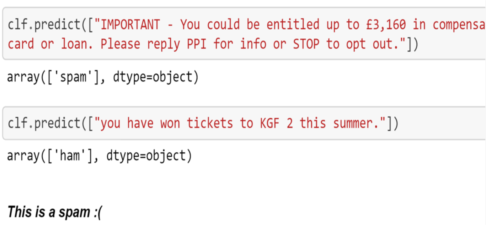

# Spam-text-Message-classification
### Thirumurugan Ramar

# Overview:
Short Message Service (SMS) is a text communication platform that allows mobile phone users to exchange short text messages (usually less than 160 7-bit characters) at a low cost. The amount of unsolicited commercial advertisements (spams) over SMS will be bigger since the cost of SMS will decrease.

Kaggle Dataset was used for this project

# Algorithms Used:
### Random forest classifier
   Accuracy:92.87%
   

### Support Vector machines
   Accuracy:94.43%
### Naive Bayes
   Accuracy:95.32%

